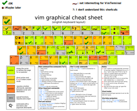

# VimTerminal

The goal of this project is to make a terminal emulator that uses vim shortcuts.

Now, you just can open it and use a couple of vim shortcuts.

## How to install it

First, you need to install SFML:

```sudo apt-get install libsfml-dev```

And after you have to compile the project

```
git clone https://github.com/titicplusplus/VimTerminal.git
cmake .
make
./VimTerminal
```

## Vim shortcuts

The project is in beta, only a couple of vim shortcuts are currently supported:


